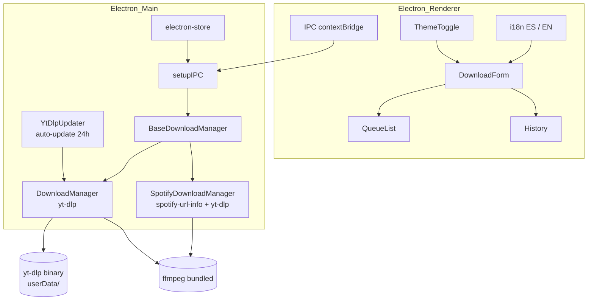

# EasyDownloader

[](https://github.com/joseamorenoc025/easy-downloader/actions)
[](https://github.com/joseamorenoc025/easy-downloader/releases/latest)
[](https://github.com/joseamorenoc025/easy-downloader/releases)
[](LICENSE)
[](#-testing)
[](.prettierrc)

> **Download videos and audio from YouTube, Spotify, and ~1700 more sites.**
> Cross-platform desktop app. No `spotdl`, no `pip`, no Python required.

[🇪🇸 Español](README.md) · [🇬🇧 English](#-what-is-it)

---

## ⚡ Quick install

| Platform | Command |
|---|---|
| **Windows** | Download `EasyDownloader-Setup-*.exe` (installer) or `EasyDownloader-*.exe` (portable) from [Releases](https://github.com/joseamorenoc025/easy-downloader/releases/latest) |
| **Debian / Ubuntu** | `sudo dpkg -i easy-downloader_*.deb && sudo apt-get install -f` |
| **Fedora / others** | `chmod +x EasyDownloader-*.AppImage && ./EasyDownloader-*.AppImage` |
| **From source** | `git clone … && npm install && npm run dev` |

> ⚠️ **Windows SmartScreen:** If you see "Windows protected your PC", click **"More info" → "Run anyway"**. The binary is not code-signed yet (see [Support the project](#-support-the-project)).

---

## What is it?

**EasyDownloader** is a cross-platform desktop app built with Electron + React + Tailwind that lets you download media content with a simple flow:

- **Paste a URL** (YouTube, Spotify, Twitter/X, TikTok, SoundCloud, Twitch, Bandcamp, archive.org, bilibili… or any of the [~1700 sites supported by yt-dlp](https://github.com/yt-dlp/yt-dlp/blob/master/supportedsites.md)).
- **Pick format and quality** (MP4 up to 1080p, or MP3 from 128 to 320 kbps).
- **Click Download.** The file lands in your folder, the item moves to history, and a toast confirms.

What makes it different: **Spotify works without installing `spotdl` or Python**. It has a native engine that uses `spotify-url-info` for metadata and `yt-dlp` to find and download the audio on YouTube. Same for yt-dlp itself: it auto-downloads on first launch, you don't have to do anything.

---

## ✨ Features

### Core
- **~1700 supported sites** via yt-dlp
- **Native Spotify** (tracks, albums, playlists) — no external dependencies
- **Quality selector** for video (480p up to `best` / 4K) and audio (128, 192, 256, 320 kbps)
- **Metadata preview** before downloading (thumbnail, title, duration, channel)
- **ID3 metadata editor** — edit title, artist, album, year, genre when downloading audio
- **6 conversion presets** — Music, Podcast, Archival, Social Media, Video HD, Video SD
- **Concurrent queue** (up to 3 simultaneous downloads)

### UX
- **Folder selector** — change download folder directly from the header dropdown
- **YouTube cookies** — import Netscape-format cookies for authenticated content
- **Notifications** — on/off toggle, native OS notification on completion
- **Portable mode** — run without installation (`--portable`)
- **Drag & drop** URLs directly onto the window
- **Global Ctrl+V** — paste the URL from anywhere, no need to focus the field
- **Persistent queue** — survives app restarts
- **System tray** with context menu and double-click to restore
- **Toast notifications** for success and errors
- **Full i18n** — Spanish and English, switchable from the header
- **Light / dark / system theme**

### Technical quality
- **Auto-updater** via GitHub Releases (notifies and downloads in the background)
- **Secure Electron**: `contextIsolation: true`, `sandbox: true`, `nodeIntegration: false`
- **Typed IPC** with contextBridge and shared types main ↔ renderer

---

## 💖 Support the project

<details>
<summary><strong>EasyDownloader is free and always will be</strong> — if you find it useful, you can support development here</summary>

EasyDownloader is maintained from Venezuela, where access to platforms like GitHub Sponsors or Patreon is limited by regional payment restrictions. That's why donations go through **cryptocurrency**, which works without intermediaries.

### 🎯 Current goal: Windows code-signing certificate

The SmartScreen warning you see on install is because the binary isn't digitally signed. A certificate costs **~$300 USD per year**. If we hit the goal, every user installs without friction.

- **Goal:** 60 people × $5 = certificate purchased
- **Want to accelerate?** A donation of $20+ puts you in the README as a sponsor ❤️

### Donation addresses

| Crypto | Address / ID |
|---|---|
| **USDT (TRC20)** | `TFRHPxCaSs5aMkEmA7kuuwnS5Md2CMXkHL` |
| **Binance Pay** | `57018184` |

You can also [open an issue](https://github.com/joseamorenoc025/easy-downloader/issues) with your donation to be added to the sponsors list.

</details>

---

## 📥 Detailed installation

### Windows

Two `.exe` files are available in [Releases](https://github.com/joseamorenoc025/easy-downloader/releases/latest):

| File | Use |
|---|---|
| `EasyDownloader-Setup-*.exe` | **NSIS Installer** — creates desktop shortcut and start menu entry. Recommended for daily use. |
| `EasyDownloader-*.exe` | **Portable** — run directly without installing. Data is saved in `portable-data/` next to the executable. Ideal for USB drives. |

For both, if SmartScreen shows the blue "Windows protected your PC" screen:
   - Click **"More info"** (cyan link)
   - Click **"Run anyway"**

The first time you open the app, `yt-dlp` downloads automatically (~30 MB, once).

> The SmartScreen warning is expected for unsigned apps. The binary is safe (see [FAQ](#-faq)).

### Debian / Ubuntu

```bash
# Download the .deb from Releases
sudo dpkg -i easy-downloader_2.x.x_amd64.deb
sudo apt-get install -f   # resolve dependencies if dpkg failed

# Launch
easy-downloader
```

Or double-click the `.deb` from your file manager.

### Fedora, Arch, and others (AppImage)

```bash
chmod +x EasyDownloader-2.x.x.AppImage
./EasyDownloader-2.x.x.AppImage
```

> If your distro doesn't support FUSE for AppImage, run with `--appimage-extract-and-run`.

### macOS

No official macOS builds yet. In the meantime:

```bash
git clone https://github.com/joseamorenoc025/easy-downloader.git
cd easy-downloader
npm install
npm run dev
```

If you'd like a native macOS build, [open an issue](https://github.com/joseamorenoc025/easy-downloader/issues/new) — if there's interest it gets prioritized.

### From source (any OS)

If you want to contribute, translate, or just try the latest development version:

```bash
git clone https://github.com/joseamorenoc025/easy-downloader.git
cd easy-downloader
npm install
npm run dev
```

Requirements: Node ≥ 20, npm ≥ 10.

---

## 🏗️ Architecture



**Typical download flow:**
1. User pastes a URL into `DownloadForm` (renderer)
2. Renderer calls the matching IPC handler (`add-download` or `add-spotify-download`)
3. The corresponding manager enqueues the item in its `BaseDownloadManager`
4. When a slot is free, it launches the `yt-dlp` process with the right flags
5. `stdout` is parsed in real time → `download-progress` events → UI updates the progress bar
6. On finish, `download-complete` fires → item moves to history + toast

---

## ⚙️ Tech stack

| Layer | Technology |
|---|---|
| **UI** | React 18 · TypeScript · Tailwind CSS · framer-motion |
| **Desktop shell** | Electron 42 · electron-vite |
| **Downloads** | yt-dlp-wrap (auto-managed) · spotify-url-info |
| **Audio conversion** | ffmpeg (bundled via `@ffmpeg-installer`) |
| **Persistence** | electron-store (JSON in `userData`) |
| **Packaging** | electron-builder (NSIS, AppImage, .deb, portable) |
| **Auto-update** | electron-updater against GitHub Releases |
| **Testing** | vitest (unit + integration) · Playwright (E2E Electron) |
| **Quality** | ESLint · Prettier · Husky · lint-staged |

---

## 🧪 Testing

The project has **107 unit tests** across 9 test files:

```bash
npm test                # unit tests (vitest)
npm run test:watch      # watch mode for development
npm run test:coverage   # coverage report with v8
npm run test:e2e        # E2E tests with Playwright
npm run test:e2e:ui     # same, with Playwright UI for debugging
npm run lint            # ESLint over src/
```

E2E tests launch the actual app in Electron and validate complete flows (launch, form, queue, history, IPC). See `src/tests/e2e/` for the structure.

---

## 👨‍💻 Development

```bash
# Setup
git clone https://github.com/joseamorenoc025/easy-downloader.git
cd easy-downloader
npm install

# Development with hot reload
npm run dev

# Build without packaging (generates out/)
npm run build

# Package installers
npm run dist:win      # → dist/EasyDownloader-Setup-2.x.x.exe
npm run dist:linux    # → dist/easy-downloader_2.x.x_amd64.deb + .AppImage
```

### Pre-commit hooks

Husky runs lint-staged before every commit:

```bash
git commit -m "feat: ..."
# → runs ESLint --fix + Prettier --write on staged files
```

---

## 📂 Project structure

```
easy-downloader/
├── src/
│   ├── main/                    # Electron main process
│   │   ├── index.ts             # Orchestrator: window, IPC, tray, updater
│   │   ├── ipc.ts               # 34 IPC handlers
│   │   ├── store.ts             # electron-store wrapper
│   │   ├── window.ts            # BrowserWindow creation
│   │   ├── tray.ts              # System tray + context menu
│   │   ├── updater.ts           # Auto-updater (electron-updater)
│   │   ├── downloader/          # Download logic
│   │   │   ├── base-manager.ts  # Abstract class: queue, cancel, retry
│   │   │   ├── manager.ts       # DownloadManager (generic yt-dlp)
│   │   │   ├── spotify-native.ts
│   │   │   ├── metadata.ts
│   │   │   ├── ffmpeg.ts
│   │   │   └── core/            # yt-dlp binary manager
│   │   ├── lib/                 # CJS module wrappers for tests
│   │   └── utils/
│   ├── preload/                 # ContextBridge (typed IPC)
│   ├── renderer/                # React UI
│   │   ├── components/          # DownloadForm, QueueList, History, etc.
│   │   ├── hooks/               # use-downloads, use-settings
│   │   ├── i18n/                # es.json, en.json
│   │   └── lib/
│   ├── tests/
│   │   ├── *.test.ts            # Unit + integration (vitest)
│   │   └── e2e/                 # Playwright E2E
│   └── types/                   # Shared types main ↔ renderer
├── resources/                   # Icons
├── .github/workflows/           # CI: build + release + lint
├── package.json
└── README.md
```

---

## ❓ FAQ

**Q: Does this only work with YouTube?**
A: No. yt-dlp supports ~1700 sites (YouTube, Vimeo, Twitter/X, TikTok, SoundCloud, Twitch, Reddit, Bandcamp, archive.org, bilibili, etc.). The toggle says "YouTube" but any valid URL works. Full list: [supportedsites.md](https://github.com/yt-dlp/yt-dlp/blob/master/supportedsites.md).

**Q: Do I need to install anything extra for Spotify?**
A: No. The app bundles a native engine that uses `spotify-url-info` for metadata and `yt-dlp` to find the audio. No Python, `pip`, or `spotdl` needed.

**Q: Why don't I see 2K / 4K in the quality selector?**
A: The UI exposes up to 1080p in the dropdown. Use the **`best`** preset which downloads the best available quality (includes 4K if the video has it).

**Q: Why does Windows show a SmartScreen warning?**
A: The binary isn't code-signed (costs ~$300/year). It's an open-source app signed only by its release hash on GitHub. SmartScreen doesn't know the publisher yet. See [Support the project](#-support-the-project) if you want to help buy the certificate.

**Q: Does the app upload my data anywhere?**
A: No. URLs go straight to `yt-dlp`, which connects to YouTube/Spotify/etc. No intermediary server. **Incognito mode** additionally doesn't save anything to history.

**Q: Can I change the download folder?**
A: Yes. Click the folder icon in the header and select "Change download folder" to pick any directory.

**Q: Does it work on Mac with Apple Silicon (M1/M2/M3)?**
A: No native build yet. In the meantime, `npm run dev` runs the app from source.

**Q: Can I contribute?**
A: Yes. See [CONTRIBUTING.md](CONTRIBUTING.md). Issues and PRs welcome.

---

## 🔧 Troubleshooting

**App doesn't download / stuck on "queued":**
- Check the dependencies banner at startup. If yt-dlp is broken, click "Retry".
- Verify your internet connection.
- If you're behind a VPN, try disabling it (some countries/ISPs block yt-dlp).

**Audio comes out without video, or video without audio:**
- On Windows: if you installed ffmpeg manually, make sure it's in `PATH`. The bundled version should work out-of-the-box.
- On Linux: `sudo apt install ffmpeg` (or equivalent).

**Linux: app won't open / crashes at startup:**
- Run from terminal to see the error: `easy-downloader`
- Make sure you have the dependencies listed in `package.json` → `build.linux.deb.depends`.

**Windows: yt-dlp doesn't download at startup:**
- If your antivirus blocks the auto-download, add `%APPDATA%\EasyDownloader` to the exceptions list.

**Downloads are slow:**
- yt-dlp uses the same performance as the CLI. If you have a heavy 4K video, it depends on your bandwidth. There's no intermediary server.

---

## 📜 License

MIT — see [LICENSE](LICENSE).

---

## 📦 Releases & versioning

We follow [Semantic Versioning](https://semver.org/). Tags `vX.Y.Z` are generated automatically on each merge to `main` via [release-drafter](https://github.com/release-drafter/release-drafter), and installers are built with [electron-builder](https://www.electron.build/).

For change details, see [CHANGELOG.md](CHANGELOG.md).

---

> Found a bug? [Open an issue](https://github.com/joseamorenoc025/easy-downloader/issues/new).
> Like the app? [Show it with a ⭐ on GitHub](https://github.com/joseamorenoc025/easy-downloader) — it helps a lot.

[🇪🇸 Español](README.md) · [🇬🇧 English](#-what-is-it)